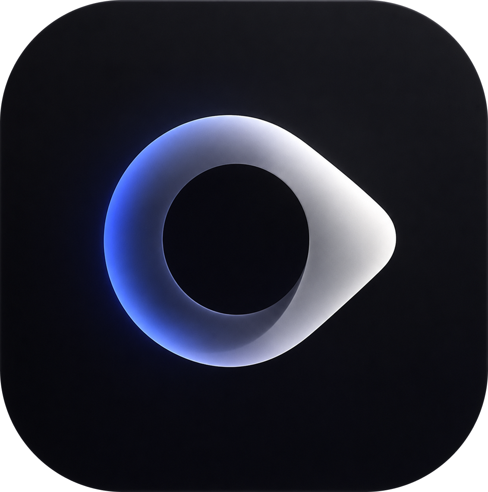

<p align="center">
  
</p>

<h1 align="center">Glance</h1>

<p align="center">
  Open-source AI desktop companion that sees your screen, points at things, and acts on them.
</p>

<p align="center">
  <a href="https://github.com/Anasabubakar/glance/releases/latest"><strong>Download v0.2.0</strong></a>&nbsp;&nbsp;|&nbsp;&nbsp;<a href="#quickstart">Quickstart</a>&nbsp;&nbsp;|&nbsp;&nbsp;<a href="#new-in-v020">What's New</a>&nbsp;&nbsp;|&nbsp;&nbsp;<a href="#features">Features</a>&nbsp;&nbsp;|&nbsp;&nbsp;<a href="#providers">Providers</a>&nbsp;&nbsp;|&nbsp;&nbsp;<a href="#building-from-source">Build from source</a>
</p>

<br>

<p align="center">
  <a href="https://github.com/Anasabubakar/glance/releases/download/v0.2.0/Setup-Glance.exe">⬇ Windows Installer</a>&nbsp;&nbsp;&nbsp;
  <a href="https://github.com/Anasabubakar/glance/releases/download/v0.2.0/glance_0.2.0_amd64.deb">⬇ .deb (Ubuntu/Debian)</a>&nbsp;&nbsp;&nbsp;
  <a href="https://github.com/Anasabubakar/glance/releases/download/v0.2.0/Glance-0.2.0-x86_64.AppImage">⬇ AppImage (any Linux)</a>
</p>

---

Hold a hotkey, talk to your computer, let go. Glance captures your screen, listens to what you said, and responds with voice and a pointing cursor that flies to exactly what you asked about.

It works with **Claude**, **OpenAI**, **Gemini**, **GitHub Copilot**, or fully offline with **Ollama** — no API keys required for local mode.

---

## New in v0.2.0

### 🎛️ Desktop Launcher Dashboard

Glance now opens a **premium control dashboard** before launching the companion. Manage everything from one place:

- **Dashboard** — Launch Glance, view provider status, system health, recent activity
- **API Keys** — Add, test (HTTP validation), save, and remove keys for all providers
- **AI Providers** — Switch between Claude, OpenAI, Gemini, Copilot, and Ollama
- **Settings** — Configure hotkey, wake word, privacy guard, code mode, and more
- **Models** — Browse and select default models per provider
- **Ollama** — Check status, select vision/text models, pull new models with progress
- **Updates** — Check for new releases via GitHub API
- **Logs** — View, filter, search, export, and clear session logs
- **Diagnostics** — System info, provider health, cache analysis
- **Cache** — Manage model cache files
- **Memory** — Manage facts and skills Glance has learned
- **Security** — Credential inventory with masked values
- **And more** — Extensions, Workspace, Downloads, About, Advanced

> The launcher is the first thing you see when Glance starts — it's your control center.

### Other improvements

- Enhanced sidebar with Glance brand logo
- Smooth fade-in window transitions
- Keyboard navigation (Ctrl+[1-9] for pages)
- Premium card-based UI consistent with Glance's brand design system
- All 17 pages connect to real functionality — no mock data

---

## Quickstart

### Windows

1. Download [**Setup-Glance.exe**](https://github.com/Anasabubakar/glance/releases/download/v0.2.0/Setup-Glance.exe)
2. Run the installer
3. Launch Glance from the Start menu or desktop shortcut
4. The **Dashboard** opens — review your setup, then click **"Start Glance"**
5. Hold **Ctrl+Alt+M**, speak, release

> The binary is unsigned. Windows SmartScreen may warn on first run — click "More info", then "Run anyway".

### Linux

**Debian / Ubuntu:**

```bash
wget https://github.com/Anasabubakar/glance/releases/download/v0.2.0/glance_0.2.0_amd64.deb
sudo apt install ./glance_0.2.0_amd64.deb
glance-companion
```

**Any distro (AppImage):**

```bash
wget https://github.com/Anasabubakar/glance/releases/download/v0.2.0/Glance-0.2.0-x86_64.AppImage
chmod +x Glance-0.2.0-x86_64.AppImage
./Glance-0.2.0-x86_64.AppImage
```

### From source

```bash
git clone https://github.com/Anasabubakar/glance.git && cd glance
pip install -e ".[shell,claude,openai,gemini]"

# Linux only — system libraries for Qt and audio
sudo apt install libportaudio2 libgl1-mesa-dev libegl1-mesa-dev libxkbcommon-dev

glance run
```

---

## Features

**🎛️ Desktop Launcher Dashboard** — The new control center opens before Glance starts. Manage providers, keys, settings, models, logs, diagnostics, and more from a premium desktop interface.

**🎤 Voice interaction** — Hold Ctrl+Alt+M (configurable), speak naturally, release. Glance transcribes your speech locally with Whisper or via Deepgram, captures your screen, sends both to your chosen LLM, and speaks the response back.

**👆 Screen-aware pointing** — The cursor overlay flies to whatever you asked about. It snaps to real UI elements using the accessibility tree (UIA on Windows, AT-SPI2 on Linux), not just pixel coordinates.

**⚡ Direct action** — Glance can open applications, click buttons, type text, and run multi-step workflows on your behalf. It asks for confirmation before destructive actions like sending messages or deleting files.

**🔄 Provider switching** — Right-click the tray icon to switch between Claude, OpenAI, Gemini, Ollama, or GitHub Copilot. Each provider's available models are fetched and listed in a submenu. No restart needed.

**🔊 Wake word** — Say "Glance" hands-free to activate without the hotkey.

**📄 Document context** — Drag and drop a PDF, DOCX, or text file onto the panel. Glance reads it and uses it as context for your next question.

**🎬 Lesson recording** — Record your screen and Glance's responses as a video walkthrough.

**📋 Workflow capture** — Let Glance watch your clicks and keystrokes, then ask "what did I just do?" to get a summary or replay instructions.

**🔧 Setup wizard** — First launch walks you through provider keys, Ollama installation, and model selection. Detects what you already have installed and skips unnecessary steps.

**📁 File organizer** — A separate CLI tool that sorts messy folders using AI or heuristics, fully reversible with `glance undo`.

---

## Providers

| Provider | Key required | Notes |
|----------|-------------|-------|
| Ollama | No | Free, local, private. Glance auto-detects and installs it for you. |
| Claude | Yes | Highest quality vision and computer use. |
| OpenAI | Yes | GPT-4o and later models with vision. |
| Gemini | Yes | Google AI Studio. Free tier available. |
| GitHub Copilot | Copilot seat | Uses your existing subscription. Free models included. |

One key is enough. Pick whichever provider you prefer, or use Ollama for a completely free and offline experience.

### Ollama setup

```bash
curl -fsSL https://ollama.com/install.sh | sh
ollama pull llama3.2-vision
```

Set `GLANCE_ACTIVE_LLM=ollama` in your `.env`, or select Ollama from the Dashboard.

---

## Configuration

The Dashboard handles configuration on first launch. For manual setup:

| Context | Path |
|---------|------|
| Running from source | `glance/shell/.env` |
| Windows installer | `%LOCALAPPDATA%\Glance\.env` |
| Linux .deb / AppImage | `~/.local/share/Glance/.env` |

Key variables:

```
ANTHROPIC_API_KEY=sk-ant-...        # or OPENAI_API_KEY, or GOOGLE_API_KEY
DEEPGRAM_API_KEY=...                # optional: faster speech-to-text
GLANCE_ACTIVE_LLM=claude            # claude | openai | gemini | ollama | copilot
GLANCE_HOTKEY=ctrl+alt+m            # push-to-talk hotkey
```

---

## File organizer

Standalone CLI for sorting cluttered directories. Works independently from the voice companion.

```bash
glance organize ~/Desktop --dry-run    # preview moves (no API key needed in heuristic mode)
glance organize ~/Desktop              # execute
glance undo                            # reverse everything
```

---

## Platform support

| | Windows | Linux |
|---|---------|-------|
| Voice companion | Yes | Yes |
| Desktop Launcher Dashboard | Yes | Yes |
| Screen capture and vision | Yes | Yes |
| Cursor pointing overlay | Yes | Yes |
| UI element snapping | UIA | AT-SPI2 |
| Click, type, launch apps | Yes | Yes |
| System tray | Yes | Yes |
| Installer | .exe | .deb, AppImage |

---

## Building from source

### Linux

```bash
make install-deps       # pip install all extras + PyInstaller
make all-linux          # portable + AppImage + .deb in dist/
```

Individual targets: `make build-linux`, `make appimage`, `make deb`.

Requires Python 3.10+, pip, dpkg-deb (for .deb), FUSE and wget (for AppImage).

### Windows

```powershell
build.bat               # portable build in dist\Glance\
build.bat installer     # also builds Setup-Glance.exe (requires Inno Setup 6)
```

Requires Python 3.10+, pip. Inno Setup is optional and only needed for the .exe installer.

---

## Project structure

```
glance/
  shell/           Voice and screen companion (the main application)
    ui/
      launcher/    Desktop Launcher Dashboard (17 management pages)
  agent/           Computer-use actuation and permission model
  providers/       LLM provider abstraction (Claude, OpenAI, Gemini, Ollama, heuristic)
  platform/        OS-specific backends (Windows UIA, Linux AT-SPI2)
  cli.py           Entry point for organize, undo, run
packaging/
  linux/           Linux build scripts and specs
  generate_icons.py
  glance_app.py    PyInstaller entry point
frontend/          Landing page and documentation site (Next.js)
```

---

## Safety

The file organizer is move-only and fully reversible.

The voice companion acts directly on your machine. It stops before irreversible, high-stakes actions (sending messages, deleting files, making purchases) and asks for confirmation. Press **Esc** at any time to cancel. This is an early release operating on your real desktop — keep an eye on it.

---

## Roadmap

- Teachable skills — show Glance a routine once, recall it by name
- MCP server — expose screen vision and pointer as a tool for other agents
- Multi-monitor improvements
- Mobile companion app for remote status and control

---

## Credits and license

Built by [Anas Abubakar](https://github.com/Anasabubakar).

Glance builds on the work of several open-source projects:

- [Clicky](https://github.com/farzaa/clicky) by @farzaa — the original macOS screen companion concept
- [Clicky for Windows](https://github.com/Bitshank-2338/clicky-windows) by Bitshank-2338 — the PyQt6 Windows port that Glance's voice and pointing pipeline derives from
- [OpenClicky](https://github.com/jasonkneen/openclicky) by @jasonkneen — the actively maintained open-source Clicky fork

Released under the [MIT License](LICENSE).
